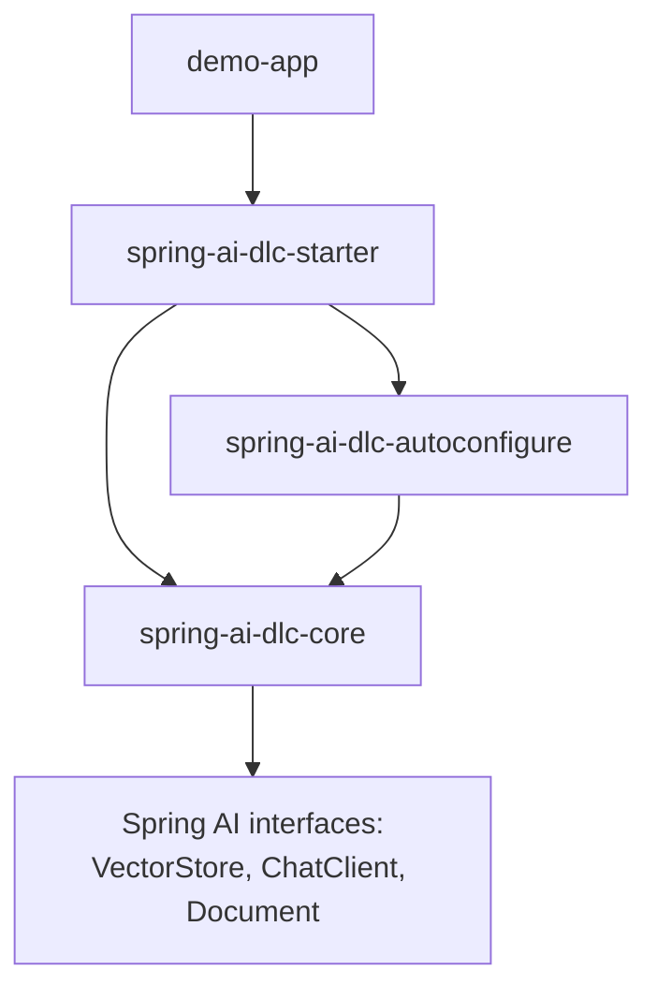

# Architecture

## Module map

- **`spring-ai-dlc-core`** — provider-neutral facades over Spring AI: `rag.ingest`
  (`IngestionPipeline`, `DocumentSource`, `ChunkingSpec`, `IngestionReport`), `rag.query`
  (`RagPipeline`, `RagAnswer`, `Citation`), and `agent` / `agent.workflow` (`Agent`,
  `AgentFactory`, `AgentDefinition`, `ToolInvocation`, `Workflow` and its `Chain`/`Parallel`/
  `Routing`/`EvaluatorOptimizer` implementations, `Workflows`). Depends only on Spring AI's
  `spring-ai-client-chat`, `spring-ai-rag`, `spring-ai-vector-store(-advisor)`, and
  `spring-ai-model` artifacts — no Spring Boot autoconfiguration, no provider starters.

- **`spring-ai-dlc-autoconfigure`** — turns the core facades into Spring Boot beans:
  `AiDlcProperties` (`ai.dlc.*`), `AiDlcChatAutoConfiguration` (default `ChatClient` +
  `SimpleLoggerAdvisor`), `AiDlcRagAutoConfiguration` (`IngestionPipeline`/`RagPipeline` beans,
  active when a `VectorStore` and `ChatClient.Builder` are present), `AiDlcAgentAutoConfiguration`
  (`AgentFactory`), and `StartupIngestionRunner`. Every bean is `@ConditionalOnMissingBean` so
  applications can override any of them.

- **`spring-ai-dlc-starter`** — thin aggregator (`api(core)` + `api(autoconfigure)`); the single
  dependency an application adds to get the full facade + autoconfiguration set.

- **`demo-app`** — runnable playground that depends on `spring-ai-dlc-starter` plus the Ollama
  and pgvector Spring AI starters. Hosts `RagController` (`/api/rag/ask`, `/api/rag/ingest`) and
  `AgentController` (`/api/agent/ask`, `/api/agent/summarize`), and ships the `rag-corpus/` docs
  that get ingested on startup.

## Future LangChain4j seam

`spring-ai-dlc-core` depends **only** on Spring AI's provider-neutral interfaces -
`VectorStore`, `ChatClient` (and its builder), and `Document` - never on a specific model
provider or vector-store implementation. If a LangChain4j-backed adapter were ever needed, it
would implement these same interfaces and be wired in at the `spring-ai-dlc-autoconfigure`
layer (or via a sibling `spring-ai-dlc-autoconfigure-langchain4j` module); `spring-ai-dlc-core`
itself would not need to change. This boundary is the reason core has no Boot or provider-starter
dependencies.
